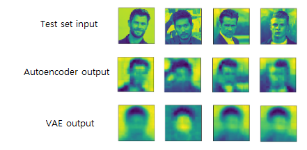
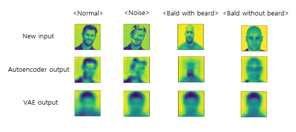
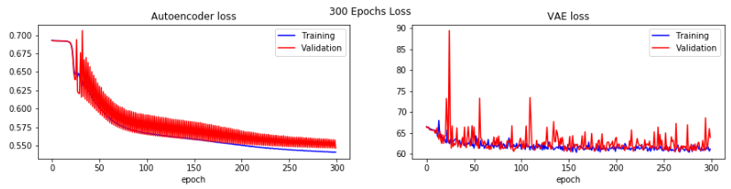
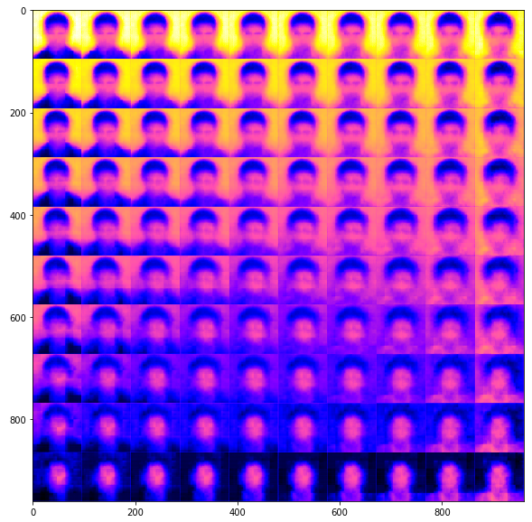
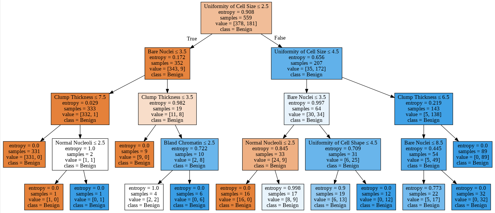
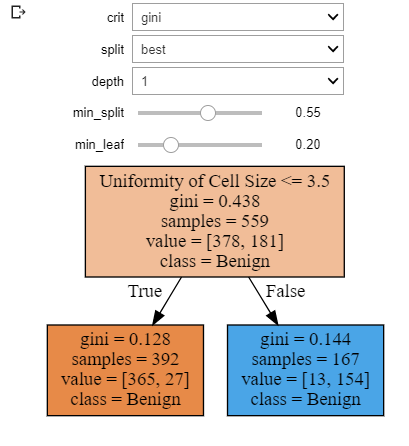
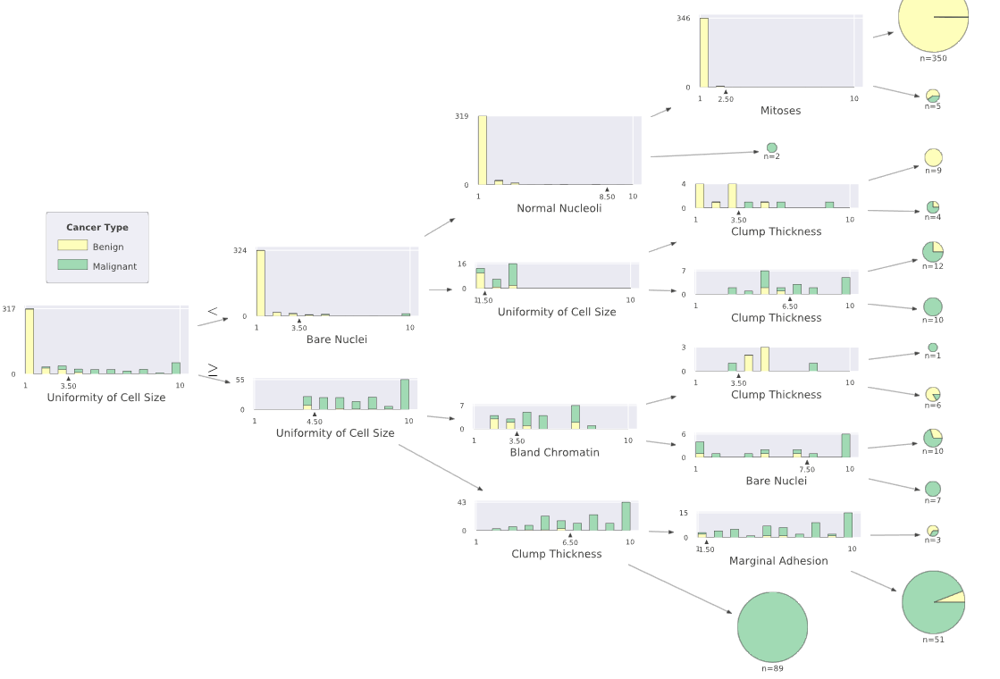
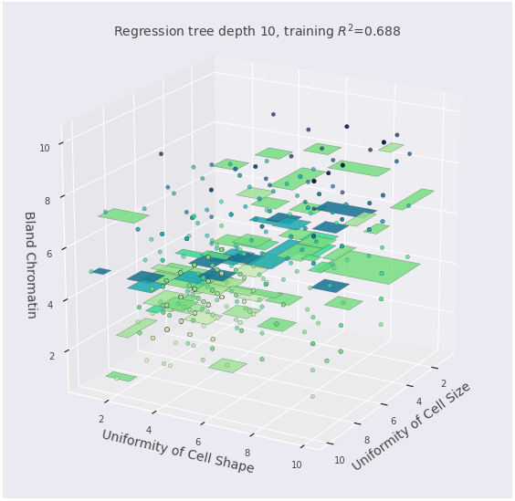
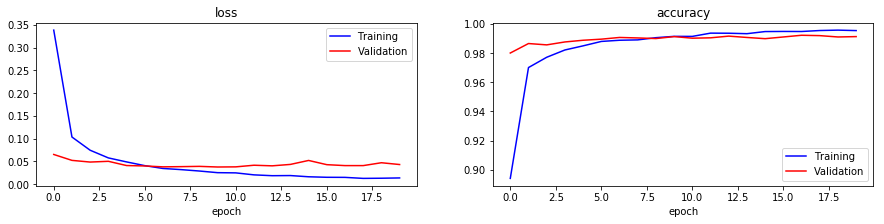

# Data Science Project Portfolio. 

This repository presents a collection of *personal Artificial Intelligence and Data Science projects* in the form of iPython Notebook. All data set were retrieved from public sources and cited. The topics and datasets being explored in this portfolio are chosen based on my own interest, the primary focus of the projects is to employ various approaches and tools of data analysis/modelling to extract buried stories of the datasets on hand. This is an on-going portfolio which will more focus on deep learning project using GPU. 

Any questions or feedback regarding this portfolio can be kindly directed to the author, Kyle Lee, at _***kylelee417@gmail.com***_.

## Projects

#### *tools: Keras, TensorFlow-GPU, scikit-learn, Pandas, Matplotlib, Seaborn, Plotly, Numpy*
* **[VAE-Hairsyle V.02][11]**: In process
* **[Variational Autoencoder(VAE)- Hairstyle V.01][10]**: This is my introductory Variational Autoencoder (VAE) model project to build a basic vae model to randomly generate different hairstyle after training the model with various front-view men hairstyle dataset. The main goal was to observe extraordinary hairstyle by sampling random latent attributes from the latent space. Hopefully, those new images of hairstyle could inspire designers or people to try a new style and individual experiencing hair loss process could preview themselves with various hairstyling after some treatment for future applications. Keras with TensorFlow backend was used to build the VAE model and an autoencoder model as well on Google Colab Jupyter notebook base. Several limitations were encountered when those models were built:

1. very limited train and test data - each dataset was created using **google_images_download** and images were directly saved on mounted google drive. very small dataset (~500 train set and ~90 test) was used to train the full vae model after mannually eliminating variables (i.e. facial orientation, faces with glasses, etc.).
2. low pixel size - 96 x 96 was used in this project. Pixels lower or higher than 96 made it very difficult building the model with deeper layers or the training was not efficient. 
3. very underfitted model - combination of #1 and #2 resulted in 53% and 61% loss performance of the autoencoder and vae models. 

For future direction to this project would be training the model with a larger dataset would give a better outcome.  After the fine training, we could manually locate the latent vectors to find specific styles so that the user can apply different hairstyles on the same face input.

  

The autoencoder model was able to catch general outlines of the original image with a 53% loss. VAE model was supposed to predict input images as much as close to the input image using a trained latent vector.  

  

Compared to the autoencoder, the vae model was able to generate a new image regardless of noise or bald input images.  

Loss Plots:

  

As you can see, both models were highly under fitted after 300 epochs. The autoencoder was somewhat showing a trend to be less under fitted after further epochs, however, it is not an efficient process. For the VAE model, better optimizations in hyperparameters are required as it did not show improvements during the whole training process.
  

    

Now let's look at the newly generated 10 x 10 images from the decoder model. Even though there was a high 62% loss, there were noticeable changes in the hair portion as the sampling points shift to the right.  
For more information understanding theories behind VAE, refer to a well summarized [Jeremy Jordan][11]'s blog. 

* **[Chest X-Ray v.1.0][8]**: A x_ray dataset was used from Kaggle [Chest X-Ray Images (Pneumonia)][9]. The main goal is building a model for a binary detction in order to defferentiate whether a test x-ray image was **Normal** or **Pneumonia**. A project to learn, build, and predict image data through ***Convolutional Neural Network (CNN)*** using Keras VGG16 (first model) and also comparing the prediction with the first model and pre-weighted **VGG16** ***(Transfer-Learning)*** model. All other resoucres that were not cited is also listed in "resource_modules.py." 

Each model was run 200 epochs with softmax activation fuction for 2 categorical outputs. This first version was to execute the model before any fine-tuning: **The model was overfitted due to relatively lower test acc. compared to the validation acc. and high loss.** 

  
 

Then, Transfer-learning from pre-weighted VGG16: **No improvement after 25 epochs and overfitting, but it is better than the first model in overall.** 

  

Detection Plots:

  
  

 
Considering the data set was not balanced (appx. 3x more pneumonia samples) and the given validation set was small, the first model has shown a very poor performance compared to the transfered VGG16 model. Oirginal validation data set had 16 samples total. Increasing the data volume would not completely solve the problem as far as the distribution of the samples were not considered the same among the three data sets. Therefore, there could be no improvement either in validation or test evaluation. For the future working instruction, definately image augmentation would show better a performance in loss, preventing overfitting. Also we can control the class_weight in fit_generator fuction to overcome the numbers of data set unbalance between noraml and pneumonia. As far as the main goal of this project is concerned, focusing fine-tuning based on the other output metrics, such as **recall** and **precision**, would help building a better model.  

* **[Master's Program Admission][1]**: Designed a customized ***Logistic Regression and SVM*** model and achieved 90% accuracy in classifying whether an aplicant would likely be admitted or not admitted using 7 different features. ***PCA*** was also performed during the EDA process; however, the information loss was more than 20%. Therefore, it was found that using a simple logictic regression or classification model such as SVM would give the best fit model considering the dataset and variables were small.

  
  
  

 

## Data Visualization Focused Projects
#### *tools required: scikit-learn, dtreeviz, graphviz, ipywidgets*
##### Unfortunately, ipywidgets do not render on Github or nbviewer. You can still view it through Google Colab or run locally to get the access
* **[Wisconsin Breast Cancer Detection ver. 1.0][4]**: Breast cancer is one of the well-known diseases for female, as well as for male, has been studied years. As far as a tumor type is concerned, early detection with a great precision and accuracy helps much better in developinsg a treating process for both patients and physicians. For this project, **decision tree** model was mainly used but in 3 different structures. 699 samples were used with 9 features to determine whether a sample is likely classified a binary target class as **Benign (non-invasive)** or **Malignant (invasive)** cancer type. 

The Area Under the Curve (AUC) was used to measure the classifier's skill in ranking a set of patterns accornding to the degree to which they belong to the positive class. However, this model is not mainly focused on performance assessment or parameter tuning. It was primarily focused on the model visualization when the true prediction (**Benign type**) is maximized for better and easier understanding.

I have found it gives eaiser interpretation using ***dtreeviz package*** than the graph created using ***graphviz***. **Random Forest** was used to overcome some overfitting problem in a single decision tree; however, the data set is too small to have comparable results. Another downside is, it does not give as much detailed interpretation as the decision tree classifier. I have also simply tried a regression tree model because the binary classification for this cancer detection can be vary depending on the random values from each feature (believing in those characteristics driven from unexpected tumor cells division during the mitosis). I used the most 3 important feature outcomes from Random Forest to construct a 3D graph and a 2D heat map; however, it did not visually show correlations among the features. Therefore, it definitely needs some optimization works or another approach like the multivariate regression model as a next goal.

**Acknowldegement:**

* Decision Tree [Concepts][7]
* Breast cancer databases: University of Wisconsin Hospitals, Madison from Dr. William H. Wolberg.
* Interactive Decision Trees Jupyter Widgets Resources, [Dafni Sidiropoulou Velidou][5]'s Blog
* More ipywidgets [Contents][6]

  
  
  
  graphiz - **left** ,    interactive decision tree - **right**
  
  **dtreeviz-visualization**
  
   **Bivariate Regression tree in 3D**
  

#### *tools: scikit-learn, Pandas, Matplotlib, Seaborn, Plotly, Numpy, Folium*
* **[2017 911 Responses in Toronto][2]**: This project mainly focused on data visualization using location data provided from Toronto City Open Data. The data frame was reorganized and clustered based on the top 10 call reason for each intersection in downtown Toronto using ***K-mean Clustering***. Then, each data were visualized on the folium map. For the future reference, it will be great to see the top 5 fire stations recieved 911 calls and to show thier coverage within x km radius on the same map. 

  
  

## Mini Capstone Projects
* **[Mini MNIST Project ver. 1.0][3]**: A simple mini project to create and test a deep learning model using MNIST data from Keras. 80:20 test split was done out of 60k dataset using the ***TensorFlow***. The model was created and tested using Google Colaboratory, GPU method. No optimization process was done because this was only meant to learn how to create a model. the loss vs. accuracy graph was created by running 20 epochs:

  

[1]:https://github.com/kylelee417/CollabProject/blob/master/project_notebook.ipynb
[2]:https://github.com/kylelee417/Capstone-Project
[3]:https://github.com/kylelee417/Data-Science_Portfolio/blob/master/TensorFlow_miniproj/tensorflow_miniproj.ipynb
[4]:https://nbviewer.jupyter.org/github/kylelee417/Data-Science_Portfolio/blob/master/Breast_Cancer/breast_cancer.ipynb
[5]:https://towardsdatascience.com/interactive-visualization-of-decision-trees-with-jupyter-widgets-ca15dd312084
[6]:https://ipywidgets.readthedocs.io/en/stable/
[7]:http://dkopczyk.quantee.co.uk/tree-based/
[8]:https://github.com/kylelee417/Data-Science_Portfolio/blob/master/Chest%20X-Ray_Pneumonia/chest_pneumonia.ipynb
[9]:https://www.kaggle.com/paultimothymooney/chest-xray-pneumonia
[10]:https://github.com/kylelee417/Data-Science_Portfolio/blob/master/VAE/VAE%20V02.ipynb
[11]:https://www.jeremyjordan.me/variational-autoencoders/
