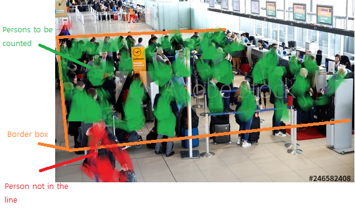

# Data Science Project Portfolio.     
 
This repository presents a collection of *personal Artificial Intelligence and Data Science projects* in the form of iPython Notebook. All data set were retrieved from public sources and cited. The topics and datasets being explored in this portfolio are chosen based on my own interest, the primary focus of the projects is to employ various approaches and tools of data analysis/modelling to extract buried stories of the datasets on hand. This is an on-going portfolio which will more focus on deep learning project using GPU. 

Any questions or feedback regarding this portfolio can be kindly directed to the author, Kyle Lee, at _***kylelee417@gmail.com***_.
## Current Project Lists
##### Click on the title for a re-direction

> Artificial Intelligence: Deep Learning
- [**SSD-MobileNet: Wait Time**](#ssd-mobilenet-wait-time-application)
- [**Asphalt Crack Segmentation**](#asphalt-crack-segmentation)
- [**Variational Autoencoder: Hairstyle**](#vae-hairstyle-v02)
- [**CNN & Transfer Learning: Chest X-ray**](#chest-x-ray)
> Data Science: Machine Learning
* [**911 Responses in Toronto**](#911-responses-in-toronto-2017)
- [**Regression & SVM: Master's Program Addmission**](#master-program-admission)
> Data Visualization Focused
* [**Decision Tree Libraries: Brest Cancer Detection**](#wisconsin-breast-cancer-detection)

## Projects

#### *tools: Keras, TensorFlow-GPU, scikit-learn, Pandas, Matplotlib, Seaborn, Plotly, Numpy*

### SSD-MobileNet Wait Time Application

To be updated.
Current plant is to use *Single Shot Multibox Detector (SSD)* model to detect customers in line and estimate the wait time.
1) base-model: MobileNet, weight load: imagenet
2) custom bounding box: remove rectangluar detector box, locate threshold infront of the counter (orange)
3) If customers in threshold box -> green, else red

 
  

### [Asphalt Crack Segmentation][13]

A simple binary segmentation was practiced using the [Unet Model][14]. **[Supervise.ly][15]** (online-segmentation platform) was used to create masks on the cracked areas of input images. Augmentations were also done using the platform as it transformed from the input images (.jason) to output images (.png + masked). 95.5%~95.6% accuracy was obtained after 50 epochs training using 224x224 pixels. 

 
  

Acknowledgement: A, Jayanth Balaji; G, Thiru Balaji; M S, Dinesh; Nair, Binoy; D. S, Harish Ram (2019), “Asphalt Crack Dataset”, Mendeley Data, v2 http://dx.doi.org/10.17632/xnzhj3x8v4.2

### [VAE Hairstyle V02][12]

Both *hair and bald* images were trained in one model. Latent dimension was increased from 2 to 128 in order to obtain more information in terms of feature distribution. **Keras-Flow From Directory** was used to build deeper layers (up to 512 filter numbers) and resize the input shape with larger pixels (112 x 112 x 1); however, more optimizations are required for better image reconstruction. The next step will be obtaining *hair* latent vector by subtracting located *bald* latent vectors from *hair inputs* and apply the *hair vectors* on new *bald inputs* to have hairs on same face.

  
  

### [Chest X-Ray][8]

A x_ray dataset was used from Kaggle [Chest X-Ray Images (Pneumonia)][9]. The main goal is building a model for a binary detction in order to defferentiate whether a test x-ray image was **Normal** or **Pneumonia**. A project to learn, build, and predict image data through ***Convolutional Neural Network (CNN)*** using Keras VGG16 (first model) and also comparing the prediction with the first model and pre-weighted **VGG16** ***(Transfer-Learning)*** model. All other resoucres that were not cited is also listed in "resource_modules.py." 

Each model was run 200 epochs with softmax activation fuction for 2 categorical outputs. This first version was to execute the model before any fine-tuning: **The model was overfitted due to relatively lower test acc. compared to the validation acc. and high loss.**

  

 
Then, Transfer-learning from pre-weighted VGG16: **No improvement after 25 epochs and overfitting, but it is better than the first model in overall.** 

  

**Detection Plots:**

  

### [Master Program Admission][1]

Designed a customized ***Logistic Regression and SVM*** model and achieved 90% accuracy in classifying whether an aplicant would likely be admitted or not admitted using 7 different features. ***PCA*** was also performed during the EDA process; however, the information loss was more than 20%. Therefore, it was found that using a simple logictic regression or classification model such as SVM would give the best fit model considering the dataset and variables were small.

  
  

## Data Visualization Focused Projects
#### *tools required: scikit-learn, dtreeviz, graphviz, ipywidgets*
##### Unfortunately, ipywidgets do not render on Github or nbviewer. You can still view it through Google Colab or run locally to get the access

### [Wisconsin Breast Cancer Detection][4]

Breast cancer is one of the well-known diseases for female, as well as for male, has been studied years. As far as a tumor type is concerned, early detection with a great precision and accuracy helps much better in developinsg a treating process for both patients and physicians. For this project, **decision tree** model was mainly used but in 3 different structures. 699 samples were used with 9 features to determine whether a sample is likely classified a binary target class as **Benign (non-invasive)** or **Malignant (invasive)** cancer type. 

I have found it gives eaiser interpretation using ***dtreeviz package*** than the graph created using ***graphviz***. **Random Forest** was used to overcome some overfitting problem in a single decision tree

**Acknowldegement:**

* Decision Tree [Concepts][7]
* Breast cancer databases: University of Wisconsin Hospitals, Madison from Dr. William H. Wolberg.
* Interactive Decision Trees Jupyter Widgets Resources, [Dafni Sidiropoulou Velidou][5]'s Blog
* More ipywidgets [Contents][6]

  
  

  graphiz - LEFT ,    interactive decision tree - RIGHT
  
  dtreeviz-visualization

   **Bivariate Regression tree in 3D**

#### *tools: scikit-learn, Pandas, Matplotlib, Seaborn, Plotly, Numpy, Folium*
### [911 Responses in Toronto 2017][2]

This project mainly focused on data visualization using location data provided from Toronto City Open Data. The data frame was reorganized and clustered based on the top 10 call reason for each intersection in downtown Toronto using ***K-mean Clustering***. Then, each data were visualized on the folium map. For the future reference, it will be great to see the top 5 fire stations recieved 911 calls and to show thier coverage within x km radius on the same map. 

  
  

## Mini Capstone Projects
[Mini MNIST Project][3]

A simple mini project to create and test a deep learning model using MNIST data from Keras. 80:20 test split was done out of 60k dataset using the ***TensorFlow***. The model was created and tested using Google Colaboratory, GPU method. No optimization process was done because this was only meant to learn how to create a model. the loss vs. accuracy graph was created by running 20 epochs:

  

[1]:https://github.com/kylelee417/CollabProject/blob/master/project_notebook.ipynb
[2]:https://github.com/kylelee417/Capstone-Project
[3]:https://github.com/kylelee417/Data-Science_Portfolio/blob/master/TensorFlow_miniproj/tensorflow_miniproj.ipynb
[4]:https://nbviewer.jupyter.org/github/kylelee417/Data-Science_Portfolio/blob/master/Breast_Cancer/breast_cancer.ipynb
[5]:https://towardsdatascience.com/interactive-visualization-of-decision-trees-with-jupyter-widgets-ca15dd312084
[6]:https://ipywidgets.readthedocs.io/en/stable/
[7]:http://dkopczyk.quantee.co.uk/tree-based/
[8]:https://github.com/kylelee417/Data-Science_Portfolio/blob/master/Chest%20X-Ray_Pneumonia/chest_pneumonia.ipynb
[9]:https://www.kaggle.com/paultimothymooney/chest-xray-pneumonia
[10]:https://github.com/kylelee417/Data-Schttps://supervise.ly/ience_Portfolio/blob/master/VAE/VAE%20V02.ipynb
[11]:https://www.jeremyjordan.me/variational-autoencoders/
[12]:https://github.com/kylelee417/Data-Science_Portfolio/blob/master/VAE/VAE2/VAE%20V02%20updated.ipynb
[13]:https://github.com/kylelee417/Asphalt_Crack_Segmentation/blob/master/Asphalt_Segmentation224.ipynb
[14]:https://github.com/zhixuhao/unet/blob/master/model.py
[15]:https://supervise.ly/
